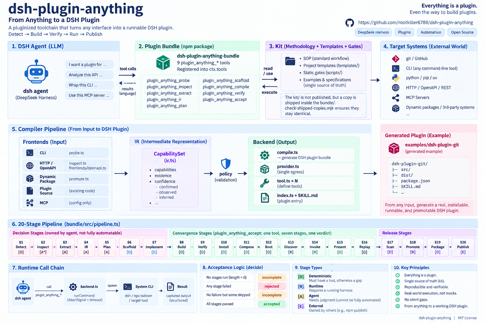

<h1 align="center">&nbsp; dsh-plugin-anything: Making ALL Software DSH-Native</h1>

<p align="center">
  
</p>

<p align="center">
  <strong>Turn anything into a DeepSeek Harness plugin.</strong><br>
  One pipeline, one compiler, one verifier — for the harness where <em>everything is already a plugin</em>.
</p>

<p align="center">
  <em>An agent-native compiler and verification pipeline that turns software capabilities into
  installable, tested, and verified DSH plugins.</em>
</p>

<p align="center">
  <a href="https://github.com/rootkiller6788/dsh-plugin-anything/actions/workflows/ci.yml"></a>
  <a href="https://github.com/rootkiller6788/dsh-plugin-anything"></a>
  <a href="LICENSE"></a>
  
  
  
</p>

**One command**: `dsh plugin --profile <profile> add dsh-plugin-anything-bundle` — install, restart, and call
the tools. Surviving the restart is the whole point; it is what a dynamic package cannot do.

---

## Golden E2E

The claim is in the name, and a claim like that is worth what its weakest category is worth. Each category is
a small but real representative, run through the whole deterministic pipeline — IR → compile → static gate →
build → typecheck → package integrity:

```
  Git CLI            ██████████  PASS
  Python CLI         ██████████  PASS
  npm CLI            ██████████  PASS
  Local Script       ██████████  PASS
  GitHub Repository  ██████████  PASS
  OpenAPI            ██████████  PASS
  MCP Server         ██████████  PASS
```

```
  Pipeline coverage        15 / 15 stages mechanized
  Runtime acceptance       PASS   (accept → accepted, with evidence)
  Package integrity        PASS   (every promised entry is in the artifact)
```

```sh
node --experimental-strip-types scripts/golden-e2e.mjs
```

The table above is **generated by that command and pinned by `scripts/check-readme-status.mjs`** — a
hand-maintained status table drifts, and a drifted one is read as current.

**MCP's PASS is a refusal, and that is the correct outcome.** An MCP server already has a supported route
into `dsh`; generating a plugin for one duplicates that route. Its golden case asserts the compiler refuses
it *and names the route to use instead* — a category that "passed" by emitting a redundant plugin would be a
regression, and `bundle/src/compile.ts` throws to prevent it.

## The pipeline is the unit, not the tool

[`bundle/src/pipeline.ts`](bundle/src/pipeline.ts) carries twenty stages, each with an owner and the reason
for that owner. Coverage is computed from it, never asserted:

| Owner | Meaning | If it has no tool |
|---|---|---|
| `deterministic` | Has a correct answer, or a contract that cannot be re-derived per run | **A hole** |
| `runtime` | Reachable only through a running harness | **A hole** |
| `agent` | Requires judgement | Correct — mechanizing it replaces intelligence with a heuristic |
| `external` | Owned outside this project | Nothing; named so the pipeline has no silent gap |

Eight tools cover fifteen stages, because a verdict like acceptance is one decision made of seven checks.
**The coverage number is the thing to watch — not the tool count.** [`docs/pipeline.md`](docs/pipeline.md) is
the full map.

## What this is

[DeepSeek Harness](https://github.com/deepseek-ai/deepseek-harness) (`dsh`) is built on vendored Cordis,
where **everything is a plugin**: the model adapter, the tool registry, the session log, and the agent loop
itself. There is no privileged core, and every part is replaceable from `cordis.yml`.

`dsh-plugin-anything` is the missing on-ramp to that architecture. Given any operable target — an external
CLI, an HTTP/REST API, a local service — it produces an installable **plugin bundle** that a `dsh` agent can
load, call, and still have after a restart.

It is a deliberate **isomorphic mirror of [CLI-Anything](https://github.com/HKUDS/CLI-Anything)**: the same
phase-by-phase methodology, the same "use the real system, don't reimplement it" iron rule, the same
registry packaging — with every landing point translated into `dsh`'s native concepts.

| CLI-Anything | dsh-plugin-anything |
|---|---|
| GUI software → agent-usable CLI | anything → dsh plugin bundle |
| `HARNESS.md` 8-phase SOP | [the same 8 phases](kit/HARNESS.md), dsh landing points |
| `core/` + `utils/<sw>_backend.py` | `src/` + `src/provider.ts` (the single egress module) |
| `click` + REPL | `defineTool` + `ctx.tools.register` |
| `SKILL.md` | `SKILL.md` (dsh frontmatter) + a mount row |
| `setup.py` → PyPI | `package.json` → npm / tarball / git |
| `registry.json` + `cli-hub` | the existing `market` registry — **reused, not rebuilt** |

## Why it exists

`dsh` already ships a loop that generates plugins from a request: the `cordis` agent preset mounts
`tool-cordis`, and the model can inspect its own runtime, write a package, and run it. That loop is
excellent for exploration and useless for delivery:

> Dynamic packages live only in the shared DSH process memory. […] They create no Plugin file, install no
> package, change no `cordis.yml` or personal/project configuration, **do not survive restart, and cannot be
> promoted automatically.**
> — `packages/extensions/tool-cordis/README.md`

**The gap is not generation. It is promotion** — turning something that works for one session into a bundle
that persists, installs, and distributes. That, plus the SOP, templates, verifier, and CI discipline around
it, is what this project provides.

<p align="center">
  
</p>

## Layout

```
dsh-plugin-anything/
├── kit/                             # the SOP kit — the single source of truth for how a bundle is built
│   ├── HARNESS.md                   #   the 8-phase methodology. Read this before anything else.
│   ├── commands/                    #   /plugin-anything, :list, :refine, :test, :validate
│   ├── guides/                      #   progressive disclosure — one guide per deep area
│   ├── templates/                   #   the files a generated bundle is assembled from
│   ├── scripts/verify-plugin.mjs    #   the static gate
│   └── tests/                       #   the gate's own acceptance tests
│
├── bundle/                          # the npm package: the plugin_anything_* tools
│   ├── src/                         #   tools.ts, pipeline.ts, ir.ts, compile.ts, accept.ts, … — 14 modules
│   ├── tests/                       #   141 tests over the whole surface
│   ├── scripts/                     #   verify-plugin.mjs, plus the accept/package/render/typecheck harnesses
│   ├── templates/ sop/ skills/ docs/  #  shipped copies of what the tools read at runtime
│   └── cordis.patch.yml             #   the bundle's patch layer
│
├── examples/
│   ├── golden/                      # one real representative per target category
│   └── dsh-plugin-git/              # a generated bundle, rendered from the templates
│
├── registry/                        # the awesome-dsh-plugin entry, and the metadata that format lacks
├── notes/                           # Agent Notes — the decisions, and what was rejected
├── scripts/                         # the acceptance ladder, the golden E2E, four consistency checks
├── docs/                            # pipeline.md, runtime-acceptance.md, and the archived plan
└── .github/workflows/               # CI: gates, golden E2E, composition against a real dsh
```

Two of those directories matter for distribution, and only one of them is published:

| Directory | What it is | How it ships |
|---|---|---|
| `bundle/` | The npm package `dsh-plugin-anything-bundle` | `cd bundle && npm publish` — installed by `dsh plugin add` |
| `kit/` | The SOP, templates, and gate | **Nothing to publish.** It is what this repository's own tooling and agents read. |

## Quick start

```sh
# 1. Read the SOP. It is the authority on every phase.
#    kit/HARNESS.md

# 2. Gate a generated bundle statically.
node kit/scripts/verify-plugin.mjs examples/dsh-plugin-git

# 3. Install and verify composition.
dsh plugin --profile dev add ./examples/dsh-plugin-git
dsh --profile dev --dump-config | grep -A3 '# == dsh-plugin-git'

# 4. Boot it, use the tools, then RESTART and use them again.
#    Surviving the restart is the whole point — it is what a dynamic package cannot do.
dsh --profile dev
```

## The kit

The methodology, templates, and gate that produce installable bundles. **A generated bundle is an output of
it, and nothing here is derived from a generated bundle.**

### Contents

| Path | What it is |
|---|---|
| [`HARNESS.md`](kit/HARNESS.md) | The 8-phase SOP. Read it before anything else. |
| [`commands/`](kit/commands) | Slash commands that execute the SOP: `/plugin-anything`, `:list`, `:refine`, `:test`, `:validate` |
| [`guides/`](kit/guides) | Progressive disclosure. Each guide is loaded on demand, never up front. |
| [`templates/`](kit/templates) | The files a generated bundle is assembled from — manifest, patch, plugin entry, provider, tool, build config, skill |
| [`scripts/verify-plugin.mjs`](kit/scripts/verify-plugin.mjs) | The static gate. Catches what fails silently. |
| [`tests/verify-plugin.test.mjs`](kit/tests/verify-plugin.test.mjs) | The gate's own acceptance tests — every check against a mutant that must fail |

### The guides

Loaded when a phase reaches them, not before.

| Guide | Read it when |
|---|---|
| [`seam-vs-consumer.md`](kit/guides/seam-vs-consumer.md) | Deciding the plugin's shape (§3). Default: Consumer. |
| [`backend-cli.md`](kit/guides/backend-cli.md) | The target is an external CLI binary |
| [`backend-http.md`](kit/guides/backend-http.md) | The target is an HTTP/REST API |
| [`backend-mcp.md`](kit/guides/backend-mcp.md) | The target speaks MCP — **usually you should not generate a plugin at all** |
| [`tool-contract.md`](kit/guides/tool-contract.md) | Writing a tool: the definition object, the schema DSL, render intent, the execution pipeline |
| [`skill-authoring.md`](kit/guides/skill-authoring.md) | Shipping a `SKILL.md`, and the `baseUrl` trap in mount rows |
| [`in-tree-vs-out-of-tree.md`](kit/guides/in-tree-vs-out-of-tree.md) | Any question about the manifest — and the stale-doc trap |
| [`snapshot-testing.md`](kit/guides/snapshot-testing.md) | Planning tests (§8). The snapshot tier is mandatory. |
| [`bundle-distribution.md`](kit/guides/bundle-distribution.md) | Shipping it (§7), and why git installs are a trust decision |
| [`static-promotion.md`](kit/guides/static-promotion.md) | Promoting a live dynamic package into a bundle |
| [`registry-entry.md`](kit/guides/registry-entry.md) | Making it discoverable. **Do not build a hub.** |
| [`verification.md`](kit/guides/verification.md) | What the gate does and does not prove |
| [`agent-notes.md`](kit/guides/agent-notes.md) | Recording a non-trivial decision |

### The templates

`package.json`, `cordis.patch.yml`, `index.ts`, `provider.ts`, `tool.ts`, `tsconfig.json`,
`tsdown.config.ts`, `SKILL.md` — each carries the verified contract for its artifact as comments, including
the traps that produce a bundle which builds cleanly and then fails to load.

### The gate

```sh
node kit/scripts/verify-plugin.mjs <plugin-dir>   # a generated bundle
node kit/scripts/verify-plugin.mjs --kit          # the kit's own structure
node --test kit/tests/verify-plugin.test.mjs      # prove the gate's checks can reject
```

It is a static approximation and says so. It catches the mistakes that fail **silently** — a patch file the
gate's glob never sees, a row that matches nothing, an entry the Loader discards. It never claims a plugin
boots; only a real `dsh --profile <p> --dump-config` and a live tool call do that.

### Conventions

- Every rule in the kit cites the `dsh` source that enforces it. When a `dsh` doc and its gate disagree,
  **the gate wins** — that has already happened once, and
  [`in-tree-vs-out-of-tree.md`](kit/guides/in-tree-vs-out-of-tree.md) records it.
- A check is not evidence until it has been observed rejecting something.
- Generated output is never hand-edited into correctness; fix the template.

## The three rules

1. **Wrap the real system. Never reimplement it.** Exactly one module in a generated plugin touches the
   outside world; everything else is pure logic and testable without the backend.
2. **Render intent is part of the design.** `generic` / `terminal` / `diff` and `locations` are decided up
   front, never after the fact.
3. **Presenters are pure functions.** They run on live streaming *and* on session-log replay — no I/O, no
   session state, no clock.

## Non-negotiables the gate enforces

A patch file whose name does not contain `cordis`; a missing `dsh.bundle.patch`; a patch not listed in
`files`; a comments-only patch (it throws at boot); `!!js` outside `config`/`disabled`; an undeclared bare
plugin name in a row; a function plugin with a `default` export; an impure presenter — each is rejected.

The gate is itself tested against single-field mutants, so every check has been observed rejecting something.

## Status

The pipeline is complete: **15 of 15 stages that require mechanization are mechanized**, and the four that do
not are judgement by design. Everything below has evidence, not assertion.

| | Evidence |
|---|---|
| The kit's gates pass, and each rejects a mutant | `node --test` on both suites |
| A generated bundle compiles against the real `@deepseek-ai/dsh-tools` types | both the scaffolded and the compiled output |
| Installation, composition, load, registration, persistence | against a real `dsh`, on both release lines |
| The model sees and calls the tools | a real turn listed all eight and called one |
| Presenters replay | from a `tool/result` a real session logged |
| The full acceptance verdict | `accept → accepted`, all seven stages with evidence |
| Seven target categories | [`scripts/golden-e2e.mjs`](scripts/golden-e2e.mjs), 7/7 |

**What is not.** `publish` — registry submission — is not this project's to manage; the entry is
format-complete and blocked on a public repository existing. And `dsh` itself is in developer preview and
warns that compatibility-breaking changes will land, so the version you peer on matters:
[`kit/guides/bundle-distribution.md`](kit/guides/bundle-distribution.md).

## License

MIT — see [`LICENSE`](LICENSE). The published bundle carries the same text, and
[`scripts/check-shipped-copies.mjs`](scripts/check-shipped-copies.mjs) pins the two together, so a change to
one cannot quietly leave the other asserting the old terms.
